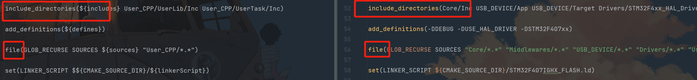

## 01 在FreeRTOS中使用浮点计算编译报错
- 在FreeRTOS中使用浮点计算时，会使用FPU，但是CubeMX生成的Cmake模板默认禁用了这个功能，会产生这样的报错
``` bash
C:\Users\22560\AppData\Local\Temp\ccW4M793.s:515: Error: selected FPU does not support instruction -- `vstmdbeq r0!,{s16-s31}'
C:\Users\22560\AppData\Local\Temp\ccW4M793.s:537: Error: selected FPU does not support instruction -- `vldmiaeq r0!,{s16-s31}'
```
- 这个问题出现在CubeMX生成的Cmake模板 **CMakeList_template.txt** 的这一段
``` txt
#Uncomment for hardware floating point
#add_compile_definitions(ARM_MATH_CM4;ARM_MATH_MATRIX_CHECK;ARM_MATH_ROUNDING)
#add_compile_options(-mfloat-abi=hard -mfpu=fpv4-sp-d16)
#add_link_options(-mfloat-abi=hard -mfpu=fpv4-sp-d16)
```
- CubeMX默认注释掉了这三行的add指令，需要手动在模板内删掉#或者是直接改生成的CMake文件，前者需要重新生成CMakeList，最后让对应的CMakeList变成如下就可以
``` CMake
#Uncomment for hardware floating point
add_compile_definitions(ARM_MATH_CM4;ARM_MATH_MATRIX_CHECK;ARM_MATH_ROUNDING)
add_compile_options(-mfloat-abi=hard -mfpu=fpv4-sp-d16)
add_link_options(-mfloat-abi=hard -mfpu=fpv4-sp-d16)
```
- 这样编译就不再会产生错误啦~
## 02 在stm32F407中使用USB设备的VCP虚拟串口（原文CSDN：https://blog.csdn.net/qq_49053936/article/details/142363059）
### 1. 时钟树的配置：
- 大疆提供的C板的HSE外部晶振的频率是12Mhz，需要使用HSE时钟源然后进行如图配置
- 
### 2. 实现USB模拟插拔，便于调试
- 原因：在调试USB期间不断修改程序，调试，烧录，如果不及时断开USB接口，会导致USB通信错误，出现端口“假死”。但是对MicroUSB接口不断地拔插会导致接口不可逆地提早损坏，所以需要在软件层面模拟插拔。
- 实现原理：**主机依靠USB接口的DP线来判断是否接入了USB设备**，没有接入设备的时候，USB的DP浮空，主机认定没有接入设备。设备端的DP线有1.5K上拉电阻，在接入的时候，USB的DP线被拉高，主机认定已经接入了USB设备。于是我们只需要在调整C板PA12（也就是DP）的电平，就可以实现USB的模拟插拔。
- 具体实现：在**usbd_conf.c**的**USER CODE BEGIN USB_OTG_FS_MspInit 0**注释对中增加以下的代码
``` C
  /* USER CODE BEGIN USB_OTG_FS_MspInit 0 */
    __HAL_RCC_GPIOA_CLK_ENABLE(); //使能GPIO端口
    GPIO_InitStruct.Pin = GPIO_PIN_12; //PA12也就是DP
    GPIO_InitStruct.Mode = GPIO_MODE_OUTPUT_PP; //定义为推挽输出
    GPIO_InitStruct.Pull = GPIO_PULLDOWN; //定义为下拉
    GPIO_InitStruct.Speed = GPIO_SPEED_FREQ_LOW; //引脚翻转速度
    HAL_GPIO_Init(GPIOA, &GPIO_InitStruct); //初始化
    HAL_Delay(50);
  /* USER CODE END USB_OTG_FS_MspInit 0 */
```
- 这段代码实现了在标准库初始化USB引脚前用户抢先声明，让PA12引脚在初始化时被拉低，然后延时50ms，让主机认为设备断开，随后用户声明被标准库覆盖，PA12引脚被拉高，主机认为设备接入，不会影响后续程序的运行。
### 3. 发送数据：`uint8_t CDC_Transmit_FS(uint8_t *Buffer, uint16_t Len)`
- 函数接收参数：缓冲区地址，字节数；如果USB正忙，则返回`USBD_BUSY`；如果成功，则返回`USBD_OK`。
- 但是这样的发送存在隐患：如果进行如下的连续发送，会导致丢包问题（USBD_BUSY导致数据无无法发出）,只能接收到“Hello”，不能收到“借点钱”
```c
while(1) {
        HAL_Delay(100);
        CDC_Transmit_FS((uint8_t *)"Hello\r", 6);
        CDC_Transmit_FS((uint8_t *)"借点钱\r", 7);
    }
```
### 4. 优化发送
1. USB虚拟串口通讯特性（特指USB2.0，全速，中断传输）：
    - USB传输是**轮询机制**，主机对从机不断进行轮询，最小间隔1ms（但间隔时长不固定,>=1ms）
    - USB传输数据是**按包进行传输**，每个包的大小为64字节（如果数据小于64字节，则需要补齐64字节，如果数据大于64字节，则需要分包发送，分包发送的包数为数据大小除以64的商，如果数据大小除以64有余数，则需要多发送一个包，最后一个包的大小为数据大小除以64的余数）
    - 每个设备在每1ms中最多传输1包数据（一包最多64字节，8*64b数据）
2. `CDC_Transmit_FS()`特性
    - 字节数为0~2048
    - 字节数 <= 64，算1包。如：发3个字节，也算1包
    - 字节数 == 0，也算1包。俗称：空包; 如果上一帧刚好发送64字节，再发一个空包作为结束包
    - 字节数 > 64， CDC_Transmit_FS ( ) 背后有缓存，它自动分包，1ms左右发1包，直至发完
3. 优化发送函数
    - 重写`CDC_Transmit_FS()`
    ``` C
    uint8_t CDC_Transmit_FS(uint8_t* Buf, uint16_t Len)
    {
    uint8_t result = USBD_OK;
    /* USER CODE BEGIN 7 */
    USBD_CDC_HandleTypeDef *hcdc = (USBD_CDC_HandleTypeDef*)hUsbDeviceFS.pClassData;//获得设备状态信息结构体
    // if (hcdc->TxState != 0){
    //   return USBD_BUSY;
    // }

    uint32_t timeStart = HAL_GetTick();      //获取进入函数时的运行时间
    while(hcdc->TxState) {                   //等待发送空闲
        if (HAL_GetTick() - timeStart > 20) {  //等待超时ms
        return USBD_BUSY;                   //没有空闲就返回；忙就放弃发送
        }
    }

    USBD_CDC_SetTxBuffer(&hUsbDeviceFS, Buf, Len);//把要发送的数据，复制到发送缓存中
    result = USBD_CDC_TransmitPacket(&hUsbDeviceFS);//发送数据（只有被主机轮询到才可以发出到主机）
    /* USER CODE END 7 */
    return result;
    }
    ```
### 4. 接收
1. 接收函数`static int8_t CDC_Receive_FS(uint8_t* Buf, uint32_t *Len)`
    - Buf：接收到的数据缓冲区
    - Len：接收到的数据长度
2. 接收机制：
    - 每当接收到一包数据，硬件自动触发中断函数， 继而调用此接收回调函数，无需人工调用。
    - 与发送机制相似，每间隔1ms，最多接收1包数据，每包最大64字节。
    - 如果需要接收超过64字节的数据帧，注意，指上位机发送的1个完整数据帧，而非USB的单包数据，如，上位机发来一张图片数据，8350个字节，则需要在此回调函数中添加额外的代码来判断帧数据传输完整结束 、手动将多个数据包拼接成完整的数据帧。
    - 接收到数据时，缓存不会提前自动清零，新数据从Buf的起始位置开始，覆盖存放。
    - 由于该回调函数是被中断函数调用的，因此建议函数内部的处理尽可能地简短，以避免影响系统的实时性（中断函数运行期间，会令程序持续挂起）。
3. 接收优化：**外部处理**
    - 只在接收函数进行复制操作，接收到的迅速复制到缓存区（耗时us级别）
    - 在主函数中数据进行进一步处理
    - 解决步骤：
        1. 增加全局变量作为缓冲区：(extern给主函数用)
        ``` C
        uint8_t myUSBRxData[64] = {0}; //接收数据缓存
        uint16_t myUSBRxNum = 0; //接收到的字节数
        ```
        2. 重写回调函数
        ``` C
        static int8_t CDC_Receive_FS(uint8_t* Buf, uint32_t *Len)
        {
        /* USER CODE BEGIN 6 */
        memset(myUSBRxData, 0, 64); //清空缓存区
        memcpy(myUSBRxData, Buf, *Len); //接收的数据复制到缓存区
        myUSBRxNum = *Len;//复制字节数
        memset(Buf, 0, 64); //处理后清空缓存区

        //指定下次数据存放的位置
        USBD_CDC_SetRxBuffer(&hUsbDeviceFS, &Buf[0]);
        USBD_CDC_ReceivePacket(&hUsbDeviceFS);
        return (USBD_OK);
        /* USER CODE END 6 */
        }
        ```
        3.主函数写处理数据函数
        ``` C
        void USBData_Process(void) {
            if(myUSBRxNum) {
                //处理业务
                myUSBRxNum = 0;//有利于判断，置0
            }
        }
        ```
        

## 03 使用CPP进行stm32编程
### 1.main函数的cpp实现（原文知乎：https://www.zhihu.com/question/640675598/answer/3418607369）
- 说实话这并不是重写一个cpp的main函数，而是写一个`CPP_main()`函数然后嵌套到原有的main函数中，用户自定义的main业务都可以写在这个函数中，而且可以使用cpp的语法而已
- 具体步骤：(修改CubeMX生成的CMakeList文件[请见05](#05-修改cubemx生成的cmakelist文件))
1. 在根目录下建立`Cpp_Core`目录，然后在其中再建立两个目录`Inc`和`Src`，在`Inc`中建立`Cpp_main.h`文件，在`Src`中建立`Cpp_main.cpp`文件
2. 在`Cpp_main.cpp`文件中`CPP_main()`函数：
3. 在`Cpp_main.h`中`#include "mian.h"`
4. 因为`main.h`中包含，cpp和c联合编译所需的宏（由于cpp的函数不能直接被c读取，需要使用extern "C" 声明，而这段宏的作用就是在如果定义了`__cplusplus`（也就是使用了cpp文件）的时候使用这个声明）
``` cpp
#ifdef __cplusplus
extern "C" {
#endif

#ifdef __cplusplus
}
#endif
```
所以需要将`int cpp_main()`函数放在`#ifdef __cplusplus`和`#endif`之间进行声明，然后在`main.c`中调用这个函数即可
``` c
int main(void)
{

  /* USER CODE BEGIN 1 */

  /* USER CODE END 1 */

  /* MCU Configuration--------------------------------------------------------*/

  /* Reset of all peripherals, Initializes the Flash interface and the Systick. */
  HAL_Init();

  /* USER CODE BEGIN Init */

  /* USER CODE END Init */

  /* Configure the system clock */
  SystemClock_Config();

  /* USER CODE BEGIN SysInit */

  /* USER CODE END SysInit */

  /* Initialize all configured peripherals */
  MX_GPIO_Init();
  /* USER CODE BEGIN 2 */

  /* USER CODE END 2 */

  /* Infinite loop */
  /* USER CODE BEGIN WHILE */
  while (1)
  {
    cpp_main();
    /* USER CODE END WHILE */

    /* USER CODE BEGIN 3 */
  }
  /* USER CODE END 3 */
}
```
### 2. 一般CPP函数的使用（以FreeRTOS重写task函数为例）
- 基本逻辑：CPP可以调用C的函数，而C不能调用CPP的函数，所以如果需要使用C++的函数，需要使用`extern "C"`声明
- 使用方法：
1. 在CPP文件中：多写一个给C的函数（建议所有CPP定义并且会出现在extern中的函数都在明明时加上CPP_前缀防止名称重复）
``` cpp
void CPP_USB_Task(){
    while(1) {
    //Task业务
    }
  }

extern "C" {
void USB_Task(void const * argument) { //给C的函数
    CPP_USB_Task();
    }
}
```
2. 在对应头文件（建议hpp文件）中：使用带宏定义修饰的extern声明
``` cpp
#ifdef __cplusplus
extern "C"{
#endif
    void USB_Task(void const * argument);
#ifdef __cplusplus
    }
#endif
```
3. 在C文件中直接使用头文件中定义的函数就可以正常编译了

## 04 `\r`与`\n`的区别
- `\r`是回车，`\n`是换行
- 回车：将光标移动到当前行的最前面
- 换行：将光标移动到下一行

## 05 修改CubeMX生成的CMakeList文件
- 基本原理：CubeMX会先生成一个模板文件`CMakeList_template.txt`，然后根据模板文件生成CMakeList文件，所以只需要修改模板文件就可以修改CMakeList文件
- 修改依据：对照CMakeList和模板文件之间的差异，修改模板文件中对应的语句，然后重新生成CMakeList文件
- 
- 主要修改索引和文件，具体修改方式见图

## 06 Stm32调试遇到内核报错
- 比如Ozone的内核报错
```
The target stopped in HardFault exception state.

Reason: A fault with configurable priority has been escalated to a HardFault exception at 0x08006FF2.

For more information about analyzing faults on Cortex-M, refer to:
https://wiki.segger.com/Cortex-M_Fault. 
``` 
- 常见排查原因：
    1. 堆/栈溢出：将CubuMX生成的堆栈大小增大，如果用了FreeRTOS，则需要将FreeRTOS的堆栈大小增大
    2. 存在调用不存在的内存区域：多层嵌套的时候检查`*`和`&`的使用是否正确
