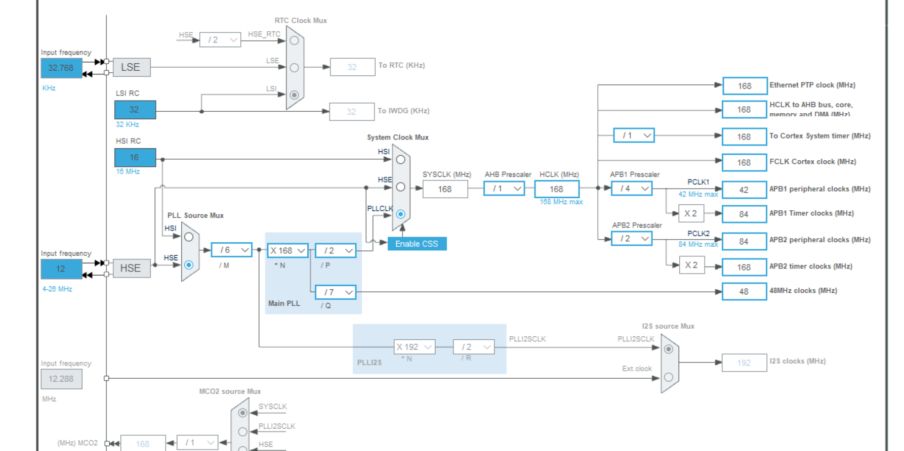

## 01 在FreeRTOS中使用浮点计算编译报错
- 在FreeRTOS中使用浮点计算时，会使用FPU，但是CubeMX生成的Cmake模板默认禁用了这个功能，会产生这样的报错
``` bash
C:\Users\22560\AppData\Local\Temp\ccW4M793.s:515: Error: selected FPU does not support instruction -- `vstmdbeq r0!,{s16-s31}'
C:\Users\22560\AppData\Local\Temp\ccW4M793.s:537: Error: selected FPU does not support instruction -- `vldmiaeq r0!,{s16-s31}'
```
- 这个问题出现在CubeMX生成的Cmake模板 **CMakeList_template.txt** 的这一段
``` txt
#Uncomment for hardware floating point
#add_compile_definitions(ARM_MATH_CM4;ARM_MATH_MATRIX_CHECK;ARM_MATH_ROUNDING)
#add_compile_options(-mfloat-abi=hard -mfpu=fpv4-sp-d16)
#add_link_options(-mfloat-abi=hard -mfpu=fpv4-sp-d16)
```
- CubeMX默认注释掉了这三行的add指令，需要手动在模板内删掉#或者是直接改生成的CMake文件，前者需要重新生成CMakeList，最后让对应的CMakeList变成如下就可以
``` CMake
#Uncomment for hardware floating point
add_compile_definitions(ARM_MATH_CM4;ARM_MATH_MATRIX_CHECK;ARM_MATH_ROUNDING)
add_compile_options(-mfloat-abi=hard -mfpu=fpv4-sp-d16)
add_link_options(-mfloat-abi=hard -mfpu=fpv4-sp-d16)
```
- 这样编译就不再会产生错误啦~
## 02 在stm32F407中使用USB设备的VCP虚拟串口
### 1. 时钟树的配置：
- 大疆提供的C板的HSE外部晶振的频率是12Mhz，需要使用HSE时钟源然后进行如图配置
- 
### 2. 实现USB模拟插拔，便于调试
- 原因：在调试USB期间不断修改程序，调试，烧录，如果不及时断开USB接口，会导致USB通信错误，出现端口“假死”。但是对MicroUSB接口不断地拔插会导致接口不可逆地提早损坏，所以需要在软件层面模拟插拔。
- 实现原理：**主机依靠USB接口的DP线来判断是否接入了USB设备**，没有接入设备的时候，USB的DP浮空，主机认定没有接入设备。设备端的DP线有1.5K上拉电阻，在接入的时候，USB的DP线被拉高，主机认定已经接入了USB设备。于是我们只需要在调整C板PA12（也就是DP）的电平，就可以实现USB的模拟插拔。
- 具体实现：在**usbd_conf.c**的**USER CODE BEGIN USB_OTG_FS_MspInit 0**注释对中增加以下的代码
``` C
  /* USER CODE BEGIN USB_OTG_FS_MspInit 0 */
    __HAL_RCC_GPIOA_CLK_ENABLE(); //使能GPIO端口
    GPIO_InitStruct.Pin = GPIO_PIN_12; //PA12也就是DP
    GPIO_InitStruct.Mode = GPIO_MODE_OUTPUT_PP; //定义为推挽输出
    GPIO_InitStruct.Pull = GPIO_PULLDOWN; //定义为下拉
    GPIO_InitStruct.Speed = GPIO_SPEED_FREQ_LOW; //引脚翻转速度
    HAL_GPIO_Init(GPIOA, &GPIO_InitStruct); //初始化
    HAL_Delay(50);
  /* USER CODE END USB_OTG_FS_MspInit 0 */
```
- 这段代码实现了在HAL库利用标准库初始化USB引脚前用户抢先声明，让PA12引脚在初始化时被拉低，然后延时50ms，让主机认为设备断开，随后用户声明被标准库覆盖，PA12引脚被拉高，主机认为设备接入，不会影响后续程序的运行。
### 3. 发送数据：`uint8_t CDC_Transmit_FS(uint8_t *Buffer, uint16_t Len)`
- 函数接收参数：缓冲区地址，字节数；如果USB正忙，则返回`USBD_BUSY`；如果成功，则返回`USBD_OK`。

## 03 使用CPP进行stm32编程
### 1.main函数的cpp实现（原文知乎：https://www.zhihu.com/question/640675598/answer/3418607369）
- 说实话这并不是重写一个cpp的main函数，而是写一个`CPP_main()`函数然后嵌套到原有的main函数中，用户自定义的main业务都可以写在这个函数中，而且可以使用cpp的语法而已
- 具体步骤：
1. 在根目录下建立`Cpp_Core`目录，然后在其中再建立两个目录`Inc`和`Src`，在`Inc`中建立`Cpp_main.h`文件，在`Src`中建立`Cpp_main.cpp`文件
2. 在`Cpp_main.cpp`文件中`CPP_main()`函数：
3. 在`Cpp_main.h`中`#include "mian.h"`
4. 因为`main.h`中包含，cpp和c联合编译所需的宏（由于cpp的函数不能直接被c读取，需要使用extern "C" 声明，而这段宏的作用就是在如果定义了`__cplusplus`（也就是使用了cpp文件）的时候使用这个声明）
``` cpp
#ifdef __cplusplus
extern "C" {
#endif

#ifdef __cplusplus
}
#endif
```
所以需要将`int cpp_main()`函数放在`#ifdef __cplusplus`和`#endif`之间进行声明，然后在`main.c`中调用这个函数即可
``` c
int main(void)
{

  /* USER CODE BEGIN 1 */

  /* USER CODE END 1 */

  /* MCU Configuration--------------------------------------------------------*/

  /* Reset of all peripherals, Initializes the Flash interface and the Systick. */
  HAL_Init();

  /* USER CODE BEGIN Init */

  /* USER CODE END Init */

  /* Configure the system clock */
  SystemClock_Config();

  /* USER CODE BEGIN SysInit */

  /* USER CODE END SysInit */

  /* Initialize all configured peripherals */
  MX_GPIO_Init();
  /* USER CODE BEGIN 2 */

  /* USER CODE END 2 */

  /* Infinite loop */
  /* USER CODE BEGIN WHILE */
  while (1)
  {
    cpp_main();
    /* USER CODE END WHILE */

    /* USER CODE BEGIN 3 */
  }
  /* USER CODE END 3 */
}
```